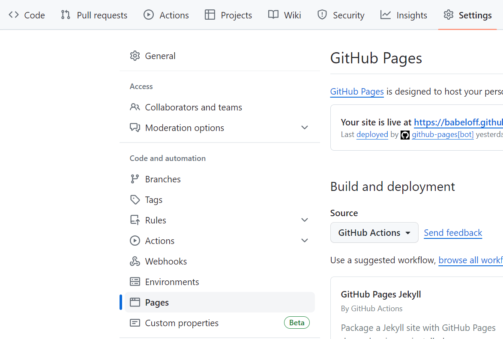

# Write Documentation

This project houses the FreeTakServer (FTS) documentation.
It is written in Markdown and mkdirs.

## Procedure

### Fork the Main Repository

You will need a `github` account.

Fork <https://github.com/FreeTAKTeam/FreeTAKServer-User-Docs> into your own account.
Clone your forked repository onto your development environment.

It will probably be useful to have two remotes,
one (upstream) for merging in upstream commits,
and one (origin) for your forked repository.

### Discuss on the FreeTAK Forum

FTS provides a Discord server where we can provide a consistent experience,
free from kindergarten dramas and with a lot of sense of humor
(keep in mind our tagline – "The parrot's not dead! It’s just resting").
You can join the FTS Discord Server here: <https://discord.gg/m8cBzQM2te>.
While Discord is cool for live interaction, it can be very inconsistent.
The forum is organized thematically, where it’s easier to stay on topic.
This will include a knowledge library of problems and solutions.
While other places may exist were enthusiast discuss our software,
the new platform is what we, the developers, will actively support.


### Make Changes

See Documentation Patterns below.


### Verify Processing

The following description is only partially correct.

#### GitHub Pages

GitHub provides the ability to publish generated documentation.
FTS makes use of this capability.

You should generate the documentation with your changes to make sure nothing was inadvertently broken.
The following shows you an example of how to set up `gh-pages` for your project repository.



The important thing here is to select `[GitHub Actions]`.


#### GitHub Action

The documentation is built via GitHub actions.
Here is the `.github/workflows/main.yml` action:
```yaml
{!../.github/workflows/main.yml!}
```
name
: The name of the workflow

on push branches main
: The event and branch which triggers this workflow

jobs deploy steps run
: Install dependencies and build the target

If the GitHub Page does not show up after a few minutes,
go to the settings of your repository and ensure that the publishing source branch for your GitHub Page is set to `gh-pages`.

### Make a Pull Request (PR)

Once you are satisfied with your changes make a GitHub pull request.

Announce your PR on the discord `Development / doc-dev` channel.
(You have been discussing your changes there, right?)

Any changes you make to the branch associated with
the PR will be included until it is approved and merged.

## Working Locally

While you will ultimately verify your work as outlined above,
it will probably be useful to work locally.

### Dependencies

Here are the packages it uses:
These packages are available for `conda`.

```shell
mamba env create -y -f docs/docs/HowToHelp/fts-doc-env.yml
```
This environment includes the packages needed to construct the document products.
```yaml
{!HowToHelp/fts-doc-env.yml!}
```

### Preview Document

Start a service to view the resulting document.
```shell
mkdocs serve
```

## Documentation Patterns

### Mkdocs and Material Theme

The markdown files are coordinated and supplemented by `mkdocs` and its plugins.
Some of the more important features of those plugins are presented here.

`mkdocs` is configured via the `mkdocs.yml` file.

### Awesome Pages

Each document directory should contain a `.pages`.
These `.pages` distribute the `nav:` element across the document
rather than collecting them in the `mkdocs.yml` file.
This implies that `mkdocs.yml` should not contain a `nav:` element.

### Markdown Includes

This file contains a typical example.
The `fts-doc-env.yml` file mentioned above is itself included using this facility.

i.e.  
\```yml  
{\!HowToHelp/fts-doc-env.yml\!}  
\```

### Mike (multi-version support)

The `fts_user/docs/versions.json` is used to define the versions.

TODO: Explain how this is to be used.

### Mermaid

For simple diagrams we use `Mermaid`.

https://mermaid.js.org/


### PlantUML

There are some case where `Mermaid` is not sufficient such as making `Network Deployment Diagrams`.
When that happens we use `PlantUML`.

https://github.com/plantuml-stdlib/C4-PlantUML/blob/master/README.md


## Writing Good Markdown

* https://docs.github.com/en/get-started/writing-on-github/getting-started-with-writing-and-formatting-on-github/basic-writing-and-formatting-syntax
* https://github.com/ikatyang/emoji-cheat-sheet/blob/master/README.md

### Ventilated Prose

Prefer ventilated prose in composition.

* https://writetheasciidocs.netlify.app/ventilated-prose
* https://vanemden.wordpress.com/2009/01/01/ventilated-prose/
* https://mattwidmann.net/notes/using-markdown-effectively/

Ventilated prose dates back to the 1930s,
when Buckminster Fuller first coined the term.

The main benefit in using ventilated prose is
that it works well with tools like `git`.
`git` defaults to using `diff` which compares lines of text.
(This `git` default is seldom changed.)
This implies that ideas should be confined to lines of text,
which is precisely what ventilated code.

### Apply Style Judiciously

It may be that a captured image is too large.
It may be tempting to resize the image.
However, if a reader wants to see the detail in the image this will lose that detail.
Instead, apply a style to the image to make it smaller.
```text
  {: style="height:200px;width:150px" }
```
