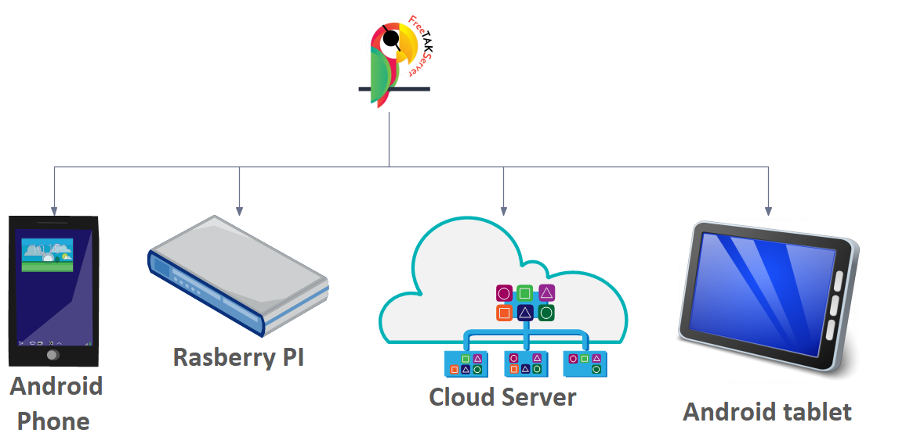
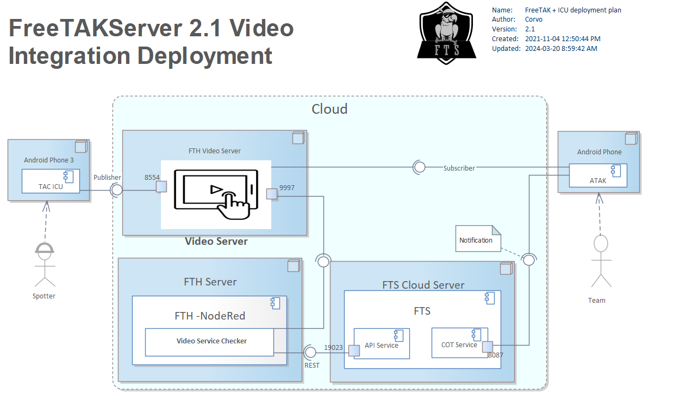
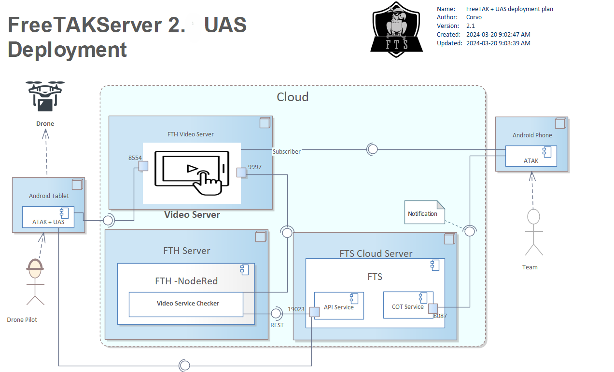
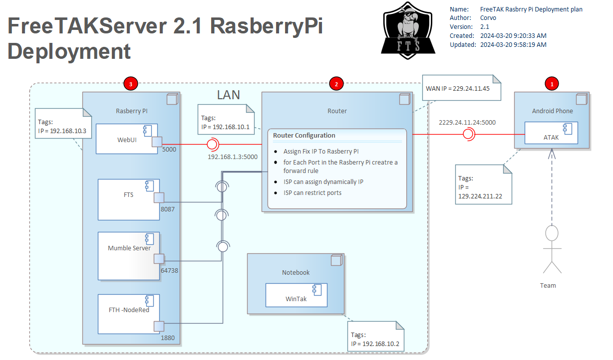
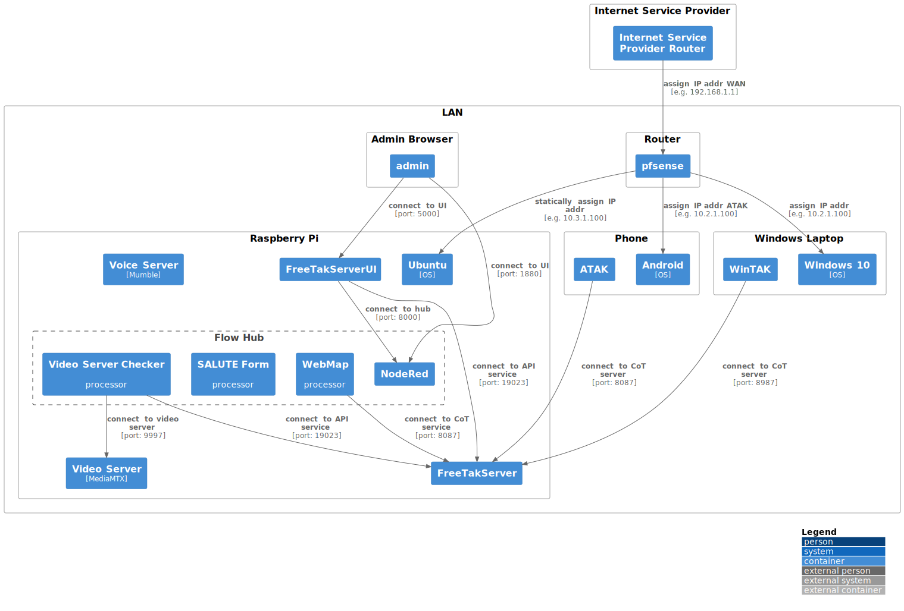
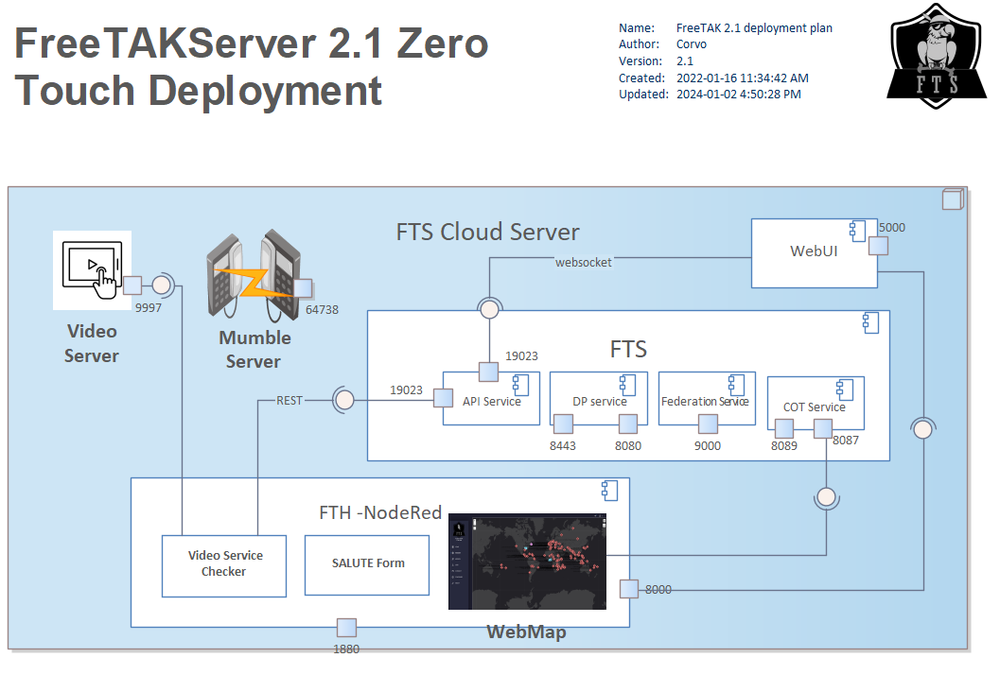

`FTS` has been installed on several platforms using different mechanisms.

## FTS Infrastructure

TAK Infrastructure thoughts: Give some thought to how you are going to deploy FTS server.

1. **Cloud** - A virtually hosted server allowing the quickest deployment
   and scalability to as many users as you may wish
2. **LAN** - An local server located on your home/office LAN.
   It may introduce additional complexities for non-LAN TAK clients to access your server,
   e.g. dynamic DNS services (<https://noip.com>) and NAT port forwarding.
3. **VPN** - An dedicated server running as a ZeroTier (or other SD-WAN) client
   will mostly circumvent the need for the complexities listed above and
   allow any TAK client on the ZeroTier network to access the dedicated server
   regardless of internet connection method (broadband, cellular data, etc.)
4. **Edge** – Can be setup completely off-grid and without reliance on a functioning internet,
   but will suffer significant limitations in range for TAK clients to connect.
   Running on an ad hoc or local infrastructure LAN configuration   
5. **Hybrid off-grid** – A collection of devices each one having
   one or more of the TAK clients connected as a "bridge"
   to an off-grid mesh network.
   This configuration will allow any off-grid mesh clients
   to have their communications reach all "internet-connected" TAK clients via a
   TAK client who is simultaneously connected to both the internet and mesh sides of the network. 
6. **Compute Cluster** – A collection services running in Linux containers.

While these are all valid configurations,
it is recommended that you first deploy one of the following standard configurations
before developing one fitting your specific situation and needs.

The following deployment diagrams augmented with network information 
are the configurations supported by the core team and are where you should start.
Notice that in these diagrams,
the data-link layer hardware,
such as switches and wireless-access-points, 
are intentionally omitted.

Realize that these configurations are examples and can be modified endlessly.
Indeed, the ZeroTouch installer deviates slightly in what it installs by default.

As you will see, configuration can be complex.
To that end we have created tooling to reduce the amount of manual configuration to a minimum.

### Cloud Installation with Video Server

This configuration supports communication between a Spotter and the Team.
Each member of the Team and the Spotter have 
Android phones running [ATAK](https://play.google.com/store/apps/details?id=com.atakmap.app.civ&hl=en_US&gl=US).
If ATAK provides all the capabilities needed by the Team,
and they were on the same local-area-network (LAN) then no TAK-server would be needed.
However, in this scenario they are not on the same LAN and the Team
wants to use TAK as a broker to gain access to a video-server.

In general, a cloud installation will expose FTS on public internet with a public IP address.

### Cloud Installation with Drone

This configuration is similar to the previous configuration but now 
the video stream originates from a remotely controlled 'drone'.
This capability is [enabled via an ATAK plugin](https://play.google.com/store/apps/details?id=com.atakmap.android.uastool.plugin&hl=en_US&gl=US).

### Private Installation on Raspberry Pi on a LAN

This configuration does not expose FTS on the public internet.
It does not broker a video-server, instead it provides a voice-chat-server,
[Mumble](https://www.mumble.info/).
The focus here is on how the LAN IP addresses are assigned.
Specifically, there is a Router on the LAN which 
acts as a bridge (or gateway) to the internet.
The socket to services in the LAN has an IP address that is typically (but not always)
assigned to the "RaspberryPi" via DHCP by the "Router". 
Somehow the configuration of FTS on the "RaspberryPi" needs to refer to that IP address is.
In other words you MUST supply that IP address in order for the installation to work properly.

!!! note 
    The IP addresses in the diagram are notional and the addresses your devices will be different.

The ATAK device is connected to the internet and
has been assigned the wide-area-network (WAN) IP address `129.224.211.12`.
The Router has a public IP address of `229.24.11.24` to which the ATAK devices connects.
The Router / Gateway also faces the LAN where it is known by IP address `192.168.10.1`.
The Router does a network-address-translation (NAT) converting each socket on the WAN to a socket on the LAN.

!!! note
    The Router is acting as a proxy for the services on the LAN and must be carefully configured.
    In particular, care must be taken to ensure that the ports on the Raspberry Pi services are unique.

The WinTAK device lives on the LAN, so, while its address is assigned by the Router
it avoids the issues associated with NAT, and communicates directly with the Raspberry Pi services.
That said WinTAK must still connect to the Raspberry Pi and so it needs to be configured
with the IP address assigned to the Raspberry Pi by the Router.

In addition, the services on the Raspberry Pi need to connect to each other.
In many cases, the services can use the localhost address `127.0.0.1` but occasionally that can cause issues,
so it is better to configure them with the IP address provided to the Raspberry Pi by the Router.

### Custom Configuration

Once you have a configuration that gives you a working system,
you are encouraged to construct a similar diagram for your specific situation.
Such a diagram will be essential when communicating about your system.
For uniformity, we recommend [`C4Model`](https://c4model.com).
The specific tool [`Mermaid2`](https://mermaid.js.org/syntax/c4.html),
which you can use to develop your network model.
The following example is for a Raspberry Pi deployment using the Zero-Touch installer.
It assumes the Router assigns IP addresses via DHCP.
Further, the Router reliably assigns the same IP address to the Raspberry Pi by using its network-interface MAC.

#### Deployment Diagram

For reference here are PlantUML designs

* [Network Deployment Diagram for FTS via Zero Touch Installer](../diagrams/src/net-deploy-rpi.puml).

## FTS Sample Configurations

The distinction between platforms and infrastructure can get fuzzy
as platforms are commonly created to address specific infrastructure requirements.
Furthermore, the installation mechanisms may need to be tailored to each platform.

1. **Digital Ocean (DO)** - The preferred **Cloud** platform.
2. [**Digital Ocean Kubernetes**](https://docs.digitalocean.com/products/kubernetes/)
   - Orchestrates a set of `micro-service` PODs. 
3. **RaspberryPi server** - The preferred **Edge** platform.
   Running on an ad-hoc or local infrastructure LAN configuration. 
4. [**RaspberryPi Kubernetes Cluster**](https://microk8s.io/docs/install-raspberry-pi)
   - Orchestrates a set of `micro-service` PODs. 
5. [**ZeroTier**](https://www.zerotier.com/download/)
   - A commercial VPN which unifies the complexities of networking across physical network boundaries. 
6. **Android Mobile** - Likely running to support `ATAK`.
7. **Windows Desktop / WSL** - Commonly used during development or troubleshooting. 
8. **Linux Desktop** - Commonly used during development or troubleshooting. 
9. **Meshtastic LoRa** - [An ad-hoc mesh using long range radios](https://meshtastic.org/).

## FTS Installation Mechanisms

The primary installation mechanisms are:

1. "Zero Touch Install" (ZTI) this is a set of Ansible roles and playbooks driven by a bash script.
2. Manual installation, where each service is installed separately.
3. Orchestrated Linux containers
   1. by [Kubernetes](https://kubernetes.io/)
   2. with [`docker-compose`](https://docs.docker.com/compose/)
   3. by [docker swarm](https://docs.docker.com/engine/swarm/).

Each of these approaches has their pros and cons.
For most beginners, the `ZTI` is the easiest place to start.

## Network 101
FreeTAKServer is a server application designed for use for Tactical Assault Kit (TAK) clients.
Like many server applications,
FreeTAKServer requires a **public IP** address in order to be accessible from the public internet.

A public IP address is a globally unique IP address that is assigned to a device by an internet service provider (ISP).
Devices on the internet use public IP addresses to communicate with each other,
and public IP addresses are necessary for devices to be accessible from outside the local network.

Without a public IP address, FreeTAKServer would only be visible within the local network.
This means that devices outside the local network,
such as those on the internet, would not be able to access or communicate with the server.
In order for FreeTAKServer to be accessible from outside the local network,
**it must have a public IP address that is routable on the internet**.

One way to make FreeTAKServer accessible from outside the local network is
to configure port forwarding on the router that connects the local network to the internet.
This allows incoming traffic on a specific port to be forwarded to the FreeTAKServer,
making it accessible from the internet using the public IP address of the router.
Another option is to use a Virtual Private Network (VPN) to connect to the local network,
which can allow remote devices to access FreeTAKServer as if they were on the local network with a private IP address.

| Private IP Address Block      | CIDR Notation  |
|-------------------------------|----------------|
| 10.0.0.0 - 10.255.255.255     | 10.0.0.0/8     |
| 172.16.0.0 - 172.31.255.255   | 172.16.0.0/12  |  
| 192.168.0.0 - 192.168.255.255 | 192.168.0.0/16 |

A 192.168.X.X IP address is part of the range of IP addresses that have been reserved
for private networks according to the Internet Assigned Numbers Authority (IANA) standard.
The 192.168.X.X range falls within the private IP address space defined by the RFC 1918.

Private IP addresses are used for local area networks (LANs) and are
**not routable over the public internet**.
They can be used by anyone without the need to register or pay for them.
Private IP addresses are typically assigned by your home router using Network Address Translation (NAT),
which allows multiple devices on a LAN to share a single public IP address.

In the case of a 192.168.X.X address,
it would typically be assigned to a device on a private network,
such as a home or office LAN.
This device would not be directly accessible from the internet,
as the 192.168.X.X address is not publicly routable.

Using private IP addresses like 192.168.X.X may help improve network security
by keeping internal devices hidden from external networks,
while still allowing them to communicate with each other within the private network.

When you connect to the internet,
your device is assigned a public IP address that can be seen by other devices on the internet.
This public IP address is used to route traffic between your device and other devices on the internet.
However, devices on the internet cannot directly access or see the private IP addresses used on your local network,
such as a 19.X.X.X address.

## Ports

A complete FTS installation includes several components that need to have access to the 'internet'.
They will typically share the same IP but have different ports that need to be open on the firewall.

### FTS Web UI (fts-ui.service)
Listening Port:

* 5000: Required for the browser based Web UI

### FTS (fts.service)

#### DigitalPy Services
Listening Port:

* 8080: Required for HTTP
* 8443: Required for HTTPS

Processes:

* DigitalPy Routing Worker Service [N instances]
* Service Manager
* Subject Service
* Integration Manager Service

#### Cursor On Target Service
Listening Port:

* 8087: required for TCP COTS
* 8089: required for SSL COTS

Processes:
* TCP CoT Service
* SSL CoT Service

#### Federation Service
Listening Port:

* 9000: Required for Federation

Processes:

* Federation Client Service
* Federation Server Service
* FTS Core Service

#### API Service
Listening Port:

* 19023: REST / websocket API for FTS

Processes:

* HTTP TAK Service
* HTTPS TAK Service
* Rest API Service

### Integration Server [NodeRed](https://nodered.org/) (nodered.service)
Listening Port:

* 1880: required for the Integration server (NodeRed)
* 8000: WebUI communication with the Integration server

Processes:

* Video Sender
* Other Misc Node Red Projects

### Brokered Services

#### Video Server [MediaMTX](https://github.com/bluenviron/mediamtx) (mediamtx.service)
Listening Port:

* 9997: required for the Video Server (MediaMTX)

#### Voice Server [Mumble](https://wiki.mumble.info/wiki/Running_Murmur) (mumble.service)
Listening Port:

* 64738: required for the Voice Server (Mumble)

#### Web Map (webmap.service)
Processes:

* WebMap

