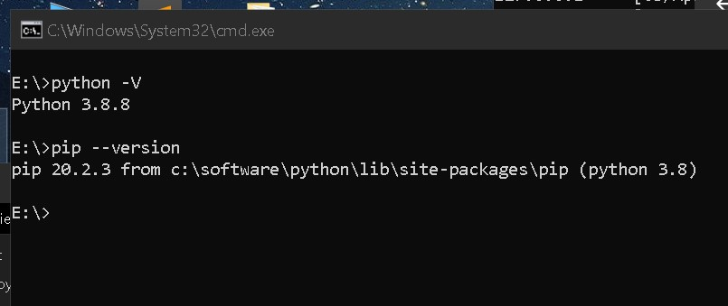

# FreeTAKServer Install On Windows Computer

Below is the installation commands and comments for the installation of FreeTAKServer on a Windows computer. 
Please notice, the FTS team is not supporting Windows as an official OS for FTS. 
Please contact the original authors.

## FreeTAKServer Manager For Windows 
[FreeTAKServer Manager]( https://github.com/Cale-Torino/FreeTAKServer_Manager) has the ability to
Start, Stop, Restart, Install, and Uninstall the FreeTAKServer & FreeTAKServer-UI.

## release version 1.5.12

FreeTAKServer provides Situational Awareness and other capabilities such as:

- sci-fi themed Web Administration
- SSL Encryption Management
- Health Monitor
- Dynamically change IP / ports, start, stop FTS services from web UI
- Service management
- Federation Service (Connecting two or more FTS or TAK server instances)
- Data Package upload and retrieval
- Private data package (user to user)
- Image transfer and storage
- COT recording in a database
- Execution of common task list (using the ExCheck plugin for WinTAK; ATAK plugin only available to users with takmaps.com access)
- User Management
- Command Line Interface
- REST API for creation of information such as emergency, Enemy units and so on

the preferred way to install FTS is by using Pip, that would solve all the required dependencies. the offline release requires additional manual work and has to be used only in the cases where internet connection is not available.

-----------

## Install Instructions

1. Install python 3.11 from python.org

   [Download and run the installer](https://www.python.org/downloads/windows/).
   The current version is 3.12, but it makes use of Cython 3.x 
   which is incompatible with several of the libraries used by FTS. 
 
   Choose the installer option.
 
   

   Check pip, tcl/tk and IDLE and the Python test suite.

   

   Make sure you add Python to environment variables for easy use.

   

2. Verify python environment 

   Check that python and pip are installed and working correctly.
   *You should be able to open cmd anywhere and do this check*:

   ```shell
   python -V
   pip --version
   ```
   

3. Install Python packages

   Having checked that Python and pip are working install the requirements:

   1. Perform install one by one via pip.

      ```shell
      pip install flask
      pip install flask_login
      pip install flask_migrate
      pip install flask_wtf
      pip install flask_sqlalchemy
      pip install email_validator
      pip install waitress

      pip install coveralls
      pip install coverage
      pip install pytest
      pip install flake8
      pip install flake8-print
      pip install pep8-naming
      pip install selenium
      ```

   2. (alternate) Perform install from a file.

      From a file Paste these requirements into a .txt file `requirements.txt` for example:
      ```text
      flask
      flask_login
      flask_migrate
      flask_wtf
      flask_sqlalchemy
      email_validator
      waitress
      coveralls
      coverage
      pytest
      flake8
      flake8-print
      pep8-naming
      selenium
      ```

      Now change into the directory (`cd`) containing said `requirements.txt` file and run the command below:

      ```shell
      pip install -r requirements.txt
      ```
            
   3. Install FreeTAKServer
      When all the requirements have been satisfied install the FreeTAKServer and FreeTAKServerUI.
      ```shell
      pip install FreeTAKServer
      pip install FreeTAKServer-UI
      ```
      
      * https://pypi.org/project/FreeTAKServer/
      * https://pypi.org/project/FreeTAKServer-UI/

4. Configure the FTS

   After the installation has finished open the `MainConfig.py` file for editing.

   The contents must be changed fo that the Windows paths can communicate with FTS.

   ```text
   MY PATH EXAMPLE
   C:\Software\python\Lib\site-packages\FreeTAKServer\controllers\configuration\MainConfig.py
   ```

   Edited contents for Windows machines:

   ```python
   import os

   currentPath = os.path.dirname(os.path.abspath(__file__))
   from pathlib import Path


   class MainConfig:
     """
     this is the main configuration file and is the only one which
     should need to be changed
     """
     # this is the port to which clients will connect
     CoTServicePort = int(8087)

     SSLCoTServicePort = int(8089)

     # this needs to be changed for private data packages to work
     DataPackageServiceDefaultIP = str("0.0.0.0")

     # User Connection package IP needs to be set to the IP which is used when creating the connection in your tak device
     UserConnectionIP = str("0.0.0.0")

     #python_version = 'python3.8'

     #userpath = '/usr/local/lib/'

     # api port
     APIPort = 19023

     # Federation port
     FederationPort = 9000

     # api IP
     APIIP = '0.0.0.0'

     # allowed ip's to access CLI commands
     AllowedCLIIPs = ['127.0.0.1']

     # IP for CLI to access
     CLIIP = '127.0.0.1'

     # whether to save CoT's to the DB
     SaveCoTToDB = bool(True)

     # this should be set before startup
     DBFilePath = str(r'C:\\Software\\python\\Lib\\site-packages\\FreeTAKServer\\FTSDataBase.db')

     # the version information of the server (recommended to leave as default)
     version = 'FreeTAKServer-1.5.12 RC1'

     MainPath = str(Path(fr'C:\\Software\\python\\Lib\\site-packages\\FreeTAKServer'))

     ExCheckMainPath = str(Path(fr'{MainPath}\\ExCheck'))

     ExCheckFilePath = str(Path(fr'{MainPath}\\ExCheck\\template'))

     ExCheckChecklistFilePath = str(Path(fr'{MainPath}\\ExCheck\\checklist'))

     DataPackageFilePath = str(Path(fr'{MainPath}\\FreeTAKServerDataPackageFolder'))

     # format of API message header should be {Authentication: Bearer 'TOKEN'}
     from uuid import uuid4
     id = str(uuid4())

     nodeID = f"FreeTAKServer-{id}"

     # set to None if you don't want a message sent
     ConnectionMessage = f'Welcome to FreeTAKServer {version}. The Parrot is not dead. It’s just resting'

     keyDir = str(Path(fr'{MainPath}\\certs\\pubserver.key'))

     pemDir = str(Path(fr'{MainPath}\\certs\\pubserver.pem')) # or crt

     unencryptedKey = str(Path(fr'{MainPath}\\certs\\pubserver.key.unencrypted'))

     p12Dir = str(Path(fr'{MainPath}\\certs\\pubserver.p12'))

     CA = str(Path(fr'{MainPath}\\certs\\ca.pem'))
     CAkey = str(Path(fr'{MainPath}\\certs\\ca.key'))

     federationCert = str(Path(fr'{MainPath}\\certs\\pubserver.pem'))
     federationKey = str(Path(fr'{MainPath}\\certs\\pubserver.key'))
     federationKeyPassword = str('defaultpass')
    
     # location to back up client packages
     clientPackages = str(Path(fr'{MainPath}\\certs\\ClientPackages'))

     password = str('defaultpass')

     websocketkey = "YourWebsocketKey"
   ```

   When finished configuring `MainConfig.py` open the `config.py` file for editing.
   ```text
   MY PATH EXAMPLE
   C:\Software\python\Lib\site-packages\FreeTAKServer-UI\config.py
   ```

   Edited contents for Windows machines:

   ```python
   # -*- encoding: utf-8 -*-
   """
   License: MIT
   Copyright (c) 2019 - present AppSeed.us
   """

   import os
   from   os import environ

   class Config(object):

     basedir    = os.path.abspath(os.path.dirname(__file__))

     SECRET_KEY = 'key'

     # This will connect to the FTS db
     SQLALCHEMY_DATABASE_URI = 'sqlite:///' + 'C:\\Software\\python\\Lib\\site-packages\\FreeTAKServer\\FTSDataBase.db'

     # certificates path
     certpath = "C:\\Software\\python\\Lib\\site-packages\\FreeTAKServer\\certs\\"

     # crt file path
     crtfilepath = f"{certpath}pubserver.pem"

     # key file path
     keyfilepath = f"{certpath}pubserver.key.unencrypted"

     # this IP will be used to connect with the FTS API
     IP = '127.0.0.1'

     # Port the  UI uses to communicate with the API
     PORT = '19023'

     # the public IP your server is exposing
     APPIP = '127.0.0.1'

     # this port will be used to listen
     APPPort = 5000

     # the webSocket  key used by the UI to communicate with FTS.
     WEBSOCKETKEY = 'YourWebsocketKey'

     # the API key used by the UI to communicate with FTS. generate a new system user and then set it
     APIKEY = 'Bearer token'

     # For 'in memory' database, please use:
     # SQLALCHEMY_DATABASE_URI = 'sqlite:///:memory:'
            
     SQLALCHEMY_TRACK_MODIFICATIONS = False

     # THEME SUPPORT
     #  if set then url_for('static', filename='', theme='')
     #  will add the theme name to the static URL:
     #    /static/<DEFAULT_THEME>/filename
     # DEFAULT_THEME = "themes/dark"
     DEFAULT_THEME = None


   class ProductionConfig(Config):
     DEBUG = False

     # Security
     SESSION_COOKIE_HTTPONLY = True
     REMEMBER_COOKIE_HTTPONLY = True
     REMEMBER_COOKIE_DURATION = 3600

     # PostgreSQL database
     SQLALCHEMY_DATABASE_URI = 'postgresql://{}:{}@{}:{}/{}'.format(
        environ.get('APPSEED_DATABASE_USER', 'appseed'),
        environ.get('APPSEED_DATABASE_PASSWORD', 'appseed'),
        environ.get('APPSEED_DATABASE_HOST', 'db'),
        environ.get('APPSEED_DATABASE_PORT', 5432),
        environ.get('APPSEED_DATABASE_NAME', 'appseed')
     )


   class DebugConfig(Config):
     DEBUG = True


   config_dict = {
     'Production': ProductionConfig,
     'Debug': DebugConfig
   }

   ```

5. Start the Server

   In order to run the server and the GUI two terminal windows must be opened and the commands below must be run:
   
   SERVER START COMMAND
   ```shell
   python -m FreeTAKServer.controllers.services.FTS
   ```
   UI START COMMAND
   ```shell
   cd C:\Software\python\Lib\site-packages\FreeTAKServer-UI
   set FLASK_APP=run.py
   flask run
   ```

6. Connect to the Server

   Now your server should be running. `User = admin`, `Password = password` and `GUI link` http://localhost:5000/

## Notes

### Start FTS During System Start

If you would like to set up a Batch file (to run the server on a double click) 
use the commands below:

Create a `.bat` file to run the server on double click and on startup:

`StartFreeTAKServer.bat`

```bat
::START THE SERVER
ECHO ON
start cmd /k python -m FreeTAKServer.controllers.services.FTS
cd C:\Software\python\Lib\site-packages\FreeTAKServer-UI
set FLASK_APP=run.py
flask run
pause
```
To run this script at startup: Go to Run (`WINDOWS + R`) and Type `shell:startup`, 
and paste a copy of your `StartFreeTAKServer.bat` file there.

## ERRORS

COT error v1.5.13


## More Info

FreeTAKServer documentation for end users

| Description        | Link                                                                                   |
|--------------------|----------------------------------------------------------------------------------------|
| User Docs:         | https://freetakteam.github.io/FreeTAKServer-User-Docs/                                 |
| PyPi Install Docs: | https://freetakteam.github.io/FreeTAKServer-User-Docs/Installation/PyPi/Linux/Install/ |
| Server Download:   | https://github.com/FreeTAKTeam/FreeTakServer                                           |
| Server Releases:   | https://github.com/FreeTAKTeam/FreeTakServer/releases                                  |


## RPiFTS Series

GHOST_DA-B6 has created a set of videos on `youtube` detailing how to install and set up FTS on raspberry pi SBC's.

You can view his RPiFTS video series on his [channel](https://www.youtube.com/channel/UC--WpY--HV7PymMWLgfflZA).
