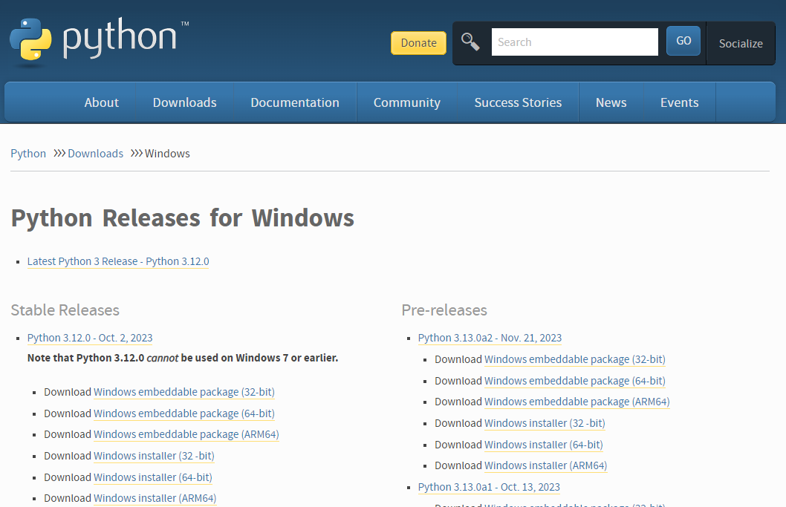
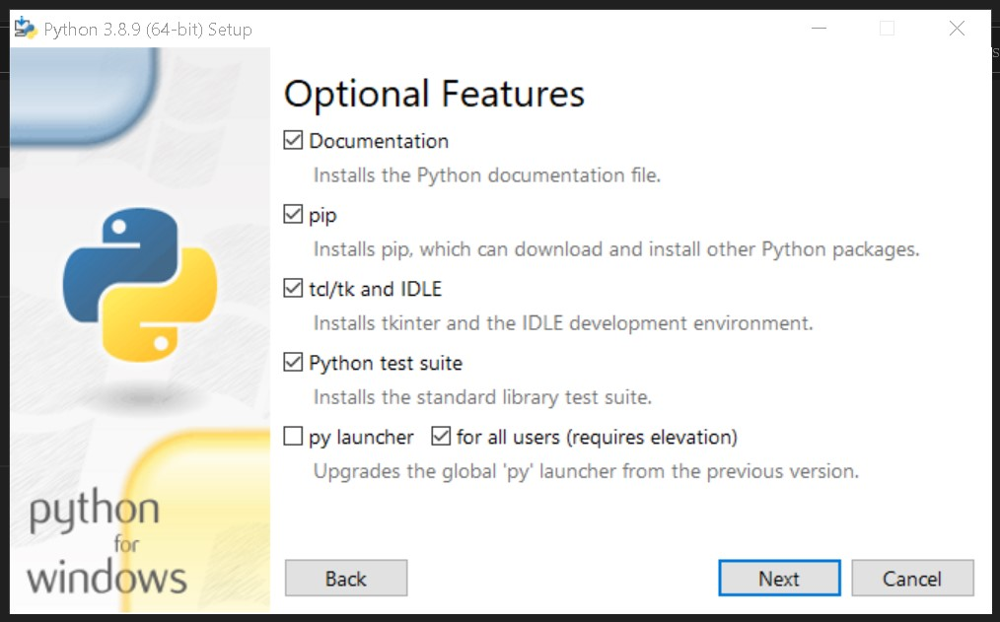
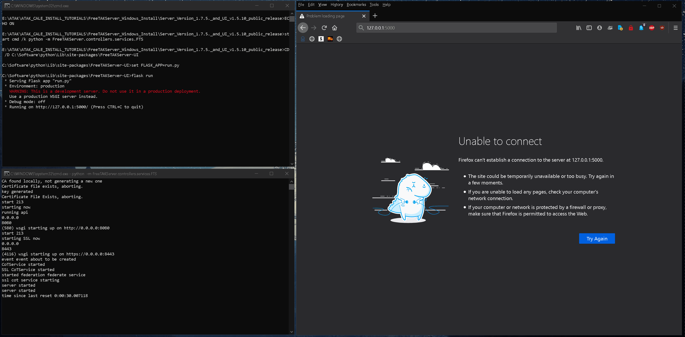

# FreeTAKServer Install On Windows Computer

Below is the installation commands and comments for the installation of FreeTAKServer on a Windows computer:

-----------

## Install Instructions (Tested on Server Version 1.7.5. and UI v1.5.10)

1. Install python from python.org

   [Download and run the installer](https://www.python.org/downloads/windows/).
 
   Choose the installer option.
 
   [](pythoninstall.png)

   Check pip, tcl/tk and IDLE and the Python test suite.

   [](features.jpg)

   Make sure you add Python to environment variables for easy use.

   [](advanced.jpg)

2. Verify python environment 

   Check that python and pip are installed and working correctly. *You should be able to open cmd anywhere and do this check*:

   ```shell
   python -V

   pip --version
   ```

   [](chkpypip.jpg)

3. Install Python packages

   Having checked that Python and pip are working install the requirements:

   1. Perform install one by one via pip.

      ```shell
      pip install flask
      pip install flask_login
      pip install flask_migrate
      pip install flask_wtf
      pip install flask_sqlalchemy
      pip install email_validator
      pip install waitress

      pip install coveralls
      pip install coverage
      pip install pytest
      pip install flake8
      pip install flake8-print
      pip install pep8-naming
      pip install selenium
      ```

   2. (alternate) Perform install from a file.

      From a file Paste these requirements into a .txt file `requirements.txt` for example:
      ```text
      flask
      flask_login
      flask_migrate
      flask_wtf
      flask_sqlalchemy
      email_validator
      waitress
      coveralls
      coverage
      pytest
      flake8
      flake8-print
      pep8-naming
      selenium
      ```

      Now change into the directory (`cd`) containing said `requirements.txt` file and run the command below:

      ```shell
      pip install -r requirements.txt
      ```
      
   3. (alternate) Install packages via conda/mamba.
      I recommend `micromamba` as it does not require Python to
      be installed a priori.
      * [micromamba install](https://mamba.readthedocs.io/en/latest/installation/micromamba-installation.html)

      Create an environment.
      ```shell
      mamba create --name tak
      mamba activate tak
      ```
      
      Install the packages into the environment.      
      ```shell
      mamba install lxml pathlib tabulate setuptools
      mamba install flask flask-login flask-migrate flask-wtf
      mamba install sqlalchemy flask-sqlalchemy 
      mamba install flake8 flake8-print 
      mamba install email-validator
      mamba install pytest coveralls coverage
      mamba install pep8-naming selenium
      mamba install waitress
      ```     
      
   4. Install FreeTAKServer
      When all the requirements have been satisfied install the FreeTAKServer and FreeTAKServerUI.
      ```shell
      pip install FreeTAKServer[ui]==0.2.1a1
      ```
      
      * https://pypi.org/project/FreeTAKServer/
      * https://pypi.org/project/FreeTAKServer-UI/

4. Configure the `FreeTakServer[UI]`

   After the installation has finished the services need to be configured.
 
   Configure the `FreeTakServer` by editing the `<site-packages>\FreeTAKServer\core\configuration\MainConfig.py` file.
 
   Path examples:
   * native Windows install: `C:\Software\python\Lib\site-packages\FreeTAKServer\core\configuration\MainConfig.py`
   * conda env named `tak`: `C:\Users\user\micromamba\envs\tak\Lib\site-packages\FreeTAKServer\core\configuration\MainConfig.py`

   Configure the `FreeTAKServer-UI` by editing the `<site-packages>\FreeTAKServer-UI\config.py` file.
 
   Path examples:
   * native Windows install: `C:\Software\python\Lib\site-packages\FreeTAKServer-UI\config.py`
   * conda env named `tak`: `C:\Users\user\micromamba\envs\tak\Lib\site-packages\FreeTAKServer-UI\config.py`

   FreeTakServer

5. Start the Server

   In order to run the server and the GUI two terminal windows must be opened and the commands below must be run:
   
   SERVER START COMMAND
   ```shell
   python -m FreeTAKServer.controllers.services.FTS
   ```
   UI START COMMAND
   ```shell
   cd C:\Software\python\Lib\site-packages\FreeTAKServer-UI
   set FLASK_APP=run.py
   flask run
   ```

6. Connect to the Server

   Now your server should be running. `User = admin`, `Password = password` and `GUI link` http://localhost:5000/

   [](FTS_windows.gif)

7. Uninstall FTS

   To uninstall do:
   ```shell
   pip uninstall FreeTAKServer
   pip uninstall FreeTAKServer-UI
   ```

   Then in the `C:\Software\python\Lib\site-packages\FreeTAKServer\` delete the `FTSDataBase.db` file.

   In the `C:\Software\python\Lib\site-packages\` path delete the `FreeTAKServer` & `FreeTAKServer-UI` folders.


## Notes

### Start FTS During System Start

If you would like to set up a Batch file (to run the server on a double click) use the commands below:

Create a `.bat` file to run the server on double click and on startup:

`StartFreeTAKServer.bat`

```bat
::START THE SERVER
ECHO ON
start cmd /k python -m FreeTAKServer.controllers.services.FTS
::WHEN RUNNING THE SCRIPT FROM A DIFFERENT DRIVE ADD THE `/D` SWITCH TO YOUR `CD` COMMAND
CD /D C:\Software\python\Lib\site-packages\FreeTAKServer-UI
set FLASK_APP=run.py
flask run
pause
```
To run this script at startup: Go to Run (`WINDOWS + R`) and Type `shell:startup`, 
and paste a copy of your `StartFreeTAKServer.bat` file there.

### Helper tasks

To check python version `python -V`

To quickly check your IP `ipconfig`

### Platform Concerns

#### `gunicorn` not available on Windows

[`gunicorn`](https://gunicorn.org/)
is not supported on Windows and is replaced by 
[`waitress`](https://github.com/Pylons/waitress).

Replace standard `gunicorn` command with `waitress-serve`.
For example: 
```shell
gunicorn --listen=*:8000 myapp.wsgi:application
```
...becomes...
```shell
waitress-serve --listen=*:8000 myapp.wsgi:application
```
