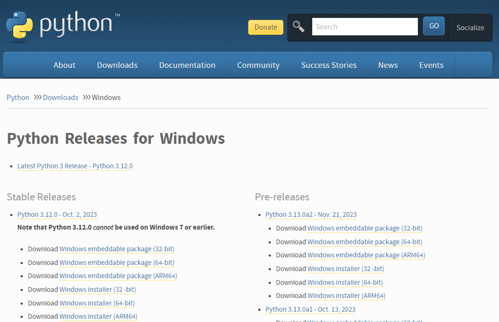

# FreeTAKServer Install On Windows Computer

Below is the installation commands and comments for the installation of FreeTAKServer on a Windows computer. 
Please notice, the FTS team is not supporting Windows as an official OS for FTS. 
Please contact the original authors.

## FreeTAKServer Manager For Windows 
[FreeTAKServer Manager]( https://github.com/Cale-Torino/FreeTAKServer_Manager) has the ability to
Start, Stop, Restart, Install, and Uninstall the FreeTAKServer & FreeTAKServer-UI.

## release version 1.5.12

FreeTAKServer provides Situational Awareness and other capabilities such as:

- sci-fi themed Web Administration
- SSL Encryption Management
- Health Monitor
- Dynamically change IP / ports, start, stop FTS services from web UI
- Service management
- Federation Service (Connecting two or more FTS or TAK server instances)
- Data Package upload and retrieval
- Private data package (user to user)
- Image transfer and storage
- CoT recording in a database
- Execution of common task list (using the `ExCheck` plugin for `WinTAK`; `ATAK` plugin only available to users with `takmaps.com` access)
- User Management
- Command Line Interface
- REST API for creation of information such as emergency, Enemy units and so on

The preferred way to install FTS is by using Pip, that would solve all the required dependencies.
The offline release requires additional manual work and has to be used
only in the cases where internet connection is not available.

-----------

## Install Instructions

### Install python 3.11 from python.org

[Download and run the installer](https://www.python.org/downloads/windows/).
The current version is 3.12, but it makes use of Cython 3.x 
which is incompatible with several of the libraries used by FTS. 

Choose the installer option.



Check pip, tcl/tk and IDLE and the Python test suite.


Make sure you add Python to environment variables for easy use.


### Verify python environment 

Check that python and pip are installed and working correctly.
*You should be able to open cmd anywhere and do this check*:

```shell
python -V
pip --version
```
It should look something like this.
```powershell
E:\>python -V
Python 3.11.0

E:\>pip --version
pip 24.0 from c:\software\python\lib\site-package\pip (python 3.11)

E:\>
```

### Install Python packages

   Having checked that Python and pip are working install the requirements:

#### `pip`: Perform install one by one

```shell
pip install flask
pip install flask_login
pip install flask_migrate
pip install flask_wtf
pip install flask_sqlalchemy
pip install email_validator
pip install waitress

pip install coveralls
pip install coverage
pip install pytest
pip install flake8
pip install flake8-print
pip install pep8-naming
pip install selenium
```

#### `pip`: (alternate) Perform install from a file

From a file Paste these requirements into a .txt file `requirements.txt` for example:
```text
flask
flask_login
flask_migrate
flask_wtf
flask_sqlalchemy
email_validator
waitress
coveralls
coverage
pytest
flake8
flake8-print
pep8-naming
selenium
```

Change into the directory (`cd`) containing said `requirements.txt` file and run the command:
```shell
pip install -r requirements.txt
```


#### `conda/mamba` (alternate) Perform install from a file

I recommend `micromamba` as it does not require that Python be installed a priori.
* [micromamba install](https://mamba.readthedocs.io/en/latest/installation/micromamba-installation.html)

Create an environment.
```shell
mamba create --name tak
mamba activate tak
```

Install the packages into that environment.      
```shell
mamba install lxml pathlib tabulate setuptools
mamba install flask flask-login flask-migrate flask-wtf
mamba install sqlalchemy flask-sqlalchemy 
mamba install flake8 flake8-print 
mamba install email-validator
mamba install pytest coveralls coverage
mamba install pep8-naming selenium
mamba install waitress
```     
            
#### Install FreeTAKServer
   When all the requirements have been satisfied install the FreeTAKServer and FreeTAKServerUI.
   ```shell
   pip install FreeTAKServer
   pip install FreeTAKServer-UI
   ```
      
   * https://pypi.org/project/FreeTAKServer/
   * https://pypi.org/project/FreeTAKServer-UI/

### Configure the FTS

After the installation has finished the server and UI may need some configuration.

The FTS server is configured with `MainConfig.py`.

After the installation has finished the services need to be configured.
 
Configure the `FreeTakServer` by editing the `<site-packages>\FreeTAKServer\core\configuration\MainConfig.py` file.

Path examples:
* native Windows install: `C:\Software\python\Lib\site-packages\FreeTAKServer\core\configuration\MainConfig.py`
* ZTI python virtual environment: `/root/fts.venv/lib/python3.11/site-packages/FreeTAKServer/core/configuration/MainConfig.py`
* conda env named `tak`: `C:\Users\user\micromamba\envs\tak\Lib\site-packages\FreeTAKServer\core\configuration\MainConfig.py`

Configure the `FreeTAKServer-UI` by editing the `<site-packages>\FreeTAKServer-UI\config.py` file.

Path examples:
* native Windows install: `C:\Software\python\Lib\site-packages\FreeTAKServer-UI\config.py`
* ZTI python virtual environment: `/root/fts.venv/lib/python3.11/site-packages/FreeTAKServer-UI/config.py`
* conda env named `tak`: `C:\Users\user\micromamba\envs\tak\Lib\site-packages\FreeTAKServer-UI\config.py`

```text
MY PATH EXAMPLE
C:\Software\python\Lib\site-packages\FreeTAKServer\controllers\configuration\MainConfig.py
```

```python
{!Installation/platform/Windows/MainConfig.py!}   
```

The FTS server UI is configured with `config.py`.

```text
MY PATH EXAMPLE
C:\Software\python\Lib\site-packages\FreeTAKServer-UI\config.py
```

```python
{!Installation/platform/Windows/config.py!}   
```

### Start the Server

In order to run the server and the GUI two terminal windows must be opened
and the commands below must be run:

SERVER START COMMAND
```shell
python -m FreeTAKServer.controllers.services.FTS
```

UI START COMMAND
```powershell
cd C:\\Software\\python\\Lib\\site-packages\\FreeTAKServer-UI
set FLASK_APP=run.py
flask run
```

### Connect to the Server

Now your server should be running.
`User = admin`, `Password = password` and `GUI link` http://localhost:5000/


#### Uninstall FTS

To uninstall do:
```shell
pip uninstall FreeTAKServer
pip uninstall FreeTAKServer-UI
```

Then in the `C:\Software\python\Lib\site-packages\FreeTAKServer\` delete the `FTSDataBase.db` file.

In the `C:\Software\python\Lib\site-packages\` path delete the `FreeTAKServer` & `FreeTAKServer-UI` folders.


## Notes

### Start FTS During System Start

If you would like to set up a Batch file (to run the server on a double click) 
use the commands below:

Create a `.bat` file to run the server on double click and on startup:

`StartFreeTAKServer.bat`

```bat
{!Installation/platform/Windows/StartFreeTAKServer.bat!} 
```
To run this script at startup: Go to Run (`WINDOWS + R`) and Type `shell:startup`, 
and paste a copy of your `StartFreeTAKServer.bat` file there.

## ERRORS

CoT error v1.5.13


## More Info

FreeTAKServer documentation for end users

| Description        | Link                                                                                     |
|--------------------|------------------------------------------------------------------------------------------|
| User Docs:         | <https://freetakteam.github.io/FreeTAKServer-User-Docs/>                                 |
| PyPi Install Docs: | <https://freetakteam.github.io/FreeTAKServer-User-Docs/Installation/PyPi/Linux/Install/> |
| Server Download:   | <https://github.com/FreeTAKTeam/FreeTakServer>                                           |
| Server Releases:   | <https://github.com/FreeTAKTeam/FreeTakServer/releases>                                  |

### Helper tasks

To check python version `python -V`

To quickly check your IP `ipconfig`

### Platform Concerns

#### `gunicorn` not available on Windows

[`gunicorn`](https://gunicorn.org/)
is not supported on Windows and is replaced by 
[`waitress`](https://github.com/Pylons/waitress).

Replace standard `gunicorn` command with `waitress-serve`.
For example: 
```shell
gunicorn --listen=*:8000 myapp.wsgi:application
```
...becomes...
```shell
waitress-serve --listen=*:8000 myapp.wsgi:application
```
