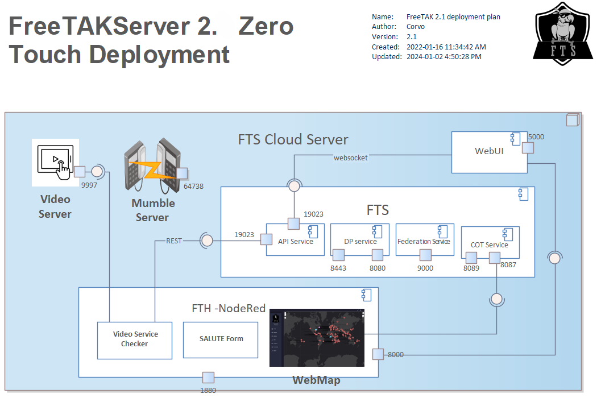

# Free TAK Server : core




## Components

The core consists of several logical components.
They are all TCP ports, some encrypted via SSL and some in the clear.

Note:: The indicated ports are default values.

### Application Programming Interface (API) Service

* REST instance (port 19023)
* websocket instance (port 19023)

### Digital Py (DP) Service

* SSL instance (port 8443)
* Clear instance (port 8080)

### Federation Service

* Clear instance (port 9000)

## CoT Service

* SSL instance (port 8089)
* Clear instance (port 8087)

## Reconfiguration

The `ZeroTouch` installer makes assumptions configuring the system. 
There are corner cases which `ZeroTouch` will miss.
For example, `ZTI` acquires the IP address by, effectively using:
```bash
curl https://ifconfig.me/ip
```
In several environments this produces the desired result.
In the case where the server is not on the public internet,
this result will be incorrect.
The following is more likely to provide the IP address you want.
```bash
ip addr
```

[Verify and/or Edit the `fts` configuration file](../administration/usingConsole.md)  
```
/opt/fts/FTSConfig.yaml
```

Here is a fragment of that configuration file.
```yaml
Addresses:
  FTS_COT_PORT: 8087
  FTS_SSLCOT_PORT: 8089
  FTS_DP_ADDRESS: 127.0.0.1
  FTS_USER_ADDRESS: 127.0.0.1
  FTS_API_PORT: 19023
  FTS_FED_PORT: 9000
  FTS_API_ADDRESS: 127.0.0.1
```
Adjust `FTS_DP_ADDRESS`, `FTS_USER_ADDRESS` & `FTS_API_ADDRESS`
to reflect your IP (or ZeroTier IP) address.


