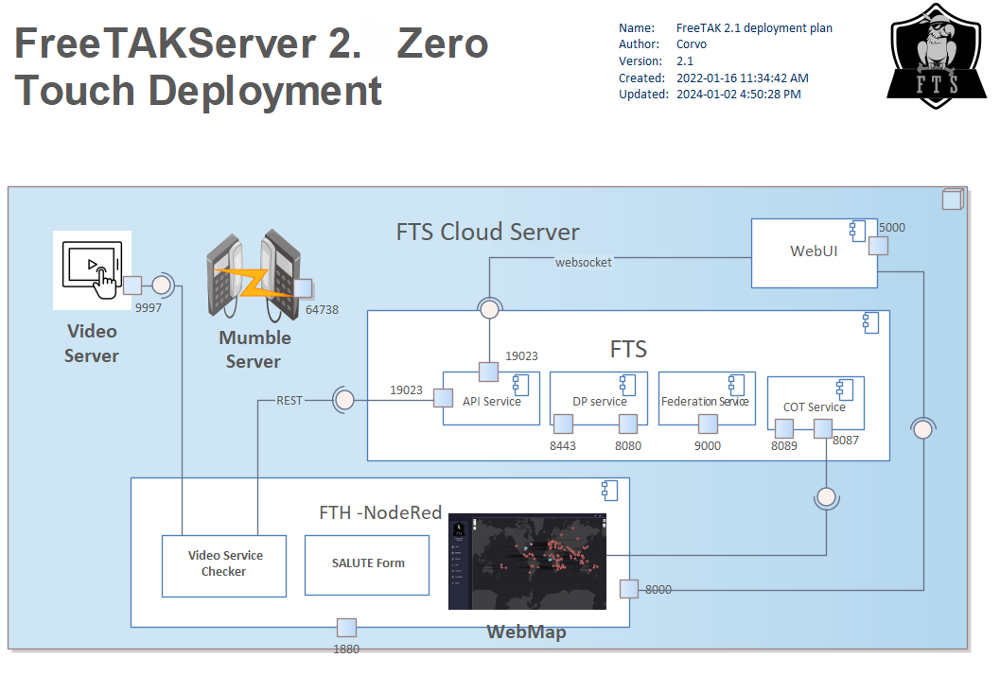

# Free TAK Server User Interface

The `WebUI` is typically under the control of `systemd` as `fts-ui.service`.




The `FTS-UI` communicates with 
the [FTS](fts-core-server.md) and 
the [FTH](fts-hub-server.md).

## Inbound Connection (in port 5000)

(port 5000)

## API Service Connection (websocket port 19023)


## Integration Connection (websocket port 8000)


## Zero Touch Installer (`ZTI`)

`ZeroTouch` makes assumptions configuring the system. 
However, there are many corner cases which `ZeroTouch` may miss.
For example, `ZTI` acquires the IP address by, effectively using:
```bash
curl http://ifconfig.me/ip
```
In many environments this produces the desired result.
In cases, not on the public internet, this result will be incorrect.
The following is more likely to be what you want.
```bash
ip addr
```

Validate the properties set in the `fts-ui` configuration file.

[Verify and/or Edit the `fts-ui` configuration file](../administration/usingConsole.md) 
Use of a python virtual environment (here the ZTI location) is recommended.
```
/root/fts.venv/lib/python3.11/site-packages/FreeTAKServer-UI/config.py
```
Here is a sample fragment of that file.
```python
class Config(object):

    # this IP will be used to connect with the FTS API
    IP = '127.0.0.1'
    
    # the public IP your server is exposing
    APPIP = '0.0.0.0'

    # The IP the Web UI service will use to access the Webmap service
    WEBMAPIP = '127.0.0.1'
    
    # The TCP port the Web UI service will use to access the Webmap service
    WEBMAPPORT = 1880

```
`ZTI` sets the `IP` and `WEBMAPIP` to your externally known IP address.
If you are not on a public network this will need to be adjusted.

`WEBMAPPORT` is 1880 for a `NodeRedFlow` install
and `8000` for a compiled `webmap`.

