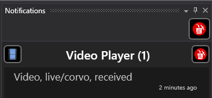
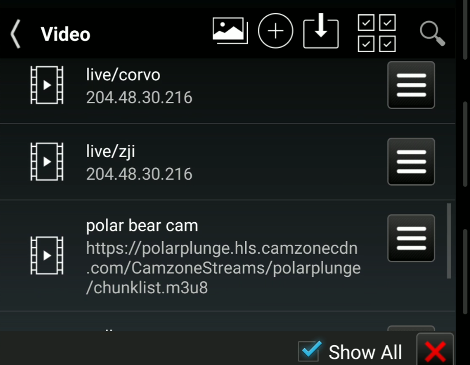
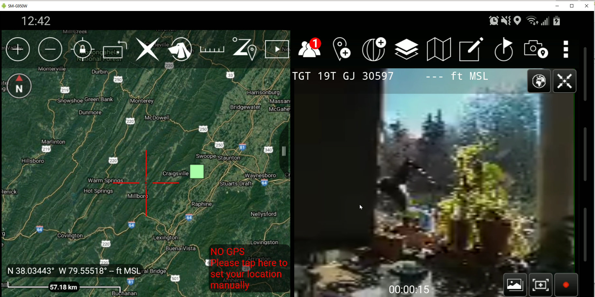
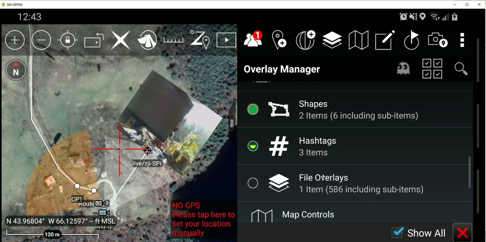

# [RTSP](https://en.wikipedia.org/wiki/Real-Time_Streaming_Protocol)

The Real-Time Streaming Protocol (RTSP) is an application-level network protocol designed for multiplexing and packetizing multimedia transport streams (such as interactive media, video and audio) over a suitable transport protocol. It is the primary protocol used by `TAK` video servers.

The following client applications may be used as an alternative to `TAK ICU`.


## Configuration

Any RTSP feed will need an appropriate URL.
```text
rstp://<ip>:8554/<feed>
```

ip
: the IP address of the `FTS Server`.

feed
: any (ascii) text, e.g. `foo`, `test`.

## [TAK ICU : ATAK Plugin](takICU.md)

This `RTSP` video generator has [its own page](takICU.md).

## [FFMPEG](https://ffmpeg.org/ffmpeg.html)

On Windows and Linux you can generate RTSP video feeds with the venerable [ffmpeg](https://ffmpeg.org/ffmpeg.html).

```shell
ffmpeg -re -stream_loop -1 -i https://download.samplelib.com/mp4/sample-5s.mp4 -c copy -f rtsp rtsp://10.68.1.101:8554/mystream
```

This loops on the https://download.samplelib.com/mp4/sample-5s.mp4 mpeg4 file sending it as the `rtsp://10.68.1.101:8554/mystream` stream.


## [Larix Broadcaster](https://softvelum.com/larix/)

Larix Broadcaster is an app for mobile devices, e.g. Android and iPad.

### Configuration

In `Settings` establish a `Connections`.
Use `Manage Connections` then use the `+` button. `Add` a `Connection`.
The Connection has the following properties:
* Name: `<feed>`
* URL: `rstp://<ip>:8554/<feed>`
* Mode: `Video only`

The `<ip>` should be set to the IP address of the `FTS Server`.
The `<feed>` can be set to any (ascii) text, e.g. `foo` or `test`.

### Usage

Return to the main screen and press the play button.

## Integration with FTS


The FTS integration, [FreeTAKHub_VideoChecker](https://github.com/FreeTAKTeam/FreeTAKHub_VideoChecker) has existed since FTS 1.9.5.
It allows for seamless streaming of videos by connecting to the video server.

Normally, when a device is streaming video, connected TAK end user device will be not notified,
it is necessary to manually create a new feed in the RTSP application.

The video stream is sent to all the connected TAK Devices



Now you can retrieve it in your video list



In the video you can open the feed and visualize it.


Touching the globe, will jump to the location of the stream,
to see its context




