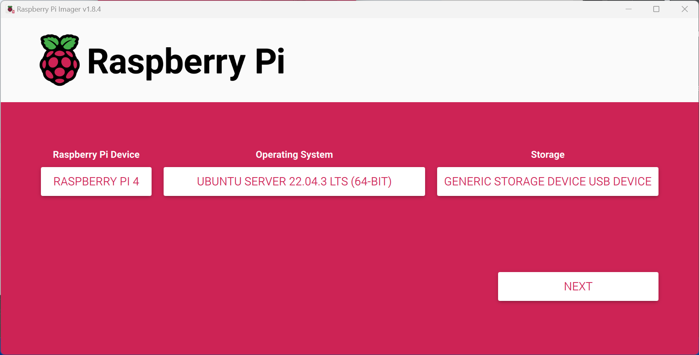

# Raspberry Pi

this procedure Installs FTS + UI + video Server onto a Raspberry Pi

## Hardware requirements
you need a RaspPi with at least 4 GB RAM

## Procedure

### Prepare an SD Card
Start with new installation of ubuntu 22.04 server for RaspPi 64.
FTS 2.1 expects [ubuntu 22.04](https://ubuntu.com/download/raspberry-pi/thank-you?version=22.04.3&architecture=server-arm64+raspi).
Previous FTS versions work 
with [Ubuntu 20.04](https://cdimage.ubuntu.com/releases/20.04.4/release/ubuntu-20.04.3-preinstalled-server-arm64+raspi.img.xz).

You will need an imager.

* [Raspberry Pi Imager](https://www.raspberrypi.com/software/) (preferred you can also use [BalenaEtcher Imager](https://www.balena.io/etcher)

Follow the instructions to create a sd card with the image.



The `rpi-imager` provides a means for setting an `ssh` authorized key and default `username` and `password`

### Setup Hardware

 * insert the prepared sd card into the Raspberry Pi.
 * connect a keyboard
 * connect a monitor
 * connect to an ethernet network

### Update the OS
 * the initial setup takes ~5 minutes on a RaspPi 4
 * login with `ubuntu` / `ubuntu` (or whichever user you selected)
   * If the RaspPi is connected to your router,
     when it boots it will display the IP grabbed from DHCP server.
     Write down the IP address, we will need it later.
   * (optional) OS may prompt you to create a new password
   * (optional) update OS: 
```bash
sudo apt update -y 
sudo apt upgrade -y 
```


In some cases you need to run: ```sudo apt full-upgrade``` or ```sudo apt-get dist-upgrade```.

It is generally easier to communicate with your server via `ssh`.
You will need the IP address (you should write the address down for later reference).
```bash
sudo apt install -y net-tools
```
```bash
ip addr
```
Here is representative fragment from an output.
```text
2: eth0: <BROADCAST,MULTICAST,UP,LOWER_UP> mtu 1500 qdisc mq state UP group default qlen 1000
    link/ether d8:3a:dd:5f:27:24 brd ff:ff:ff:ff:ff:ff
    inet 10.2.118.237/24 metric 100 brd 10.2.118.255 scope global dynamic eth0
       valid_lft 53818sec preferred_lft 53818sec
    inet6 fe80::da3a:ddff:fe5f:2724/64 scope link
       valid_lft forever preferred_lft forever
```
The IP address in this case is `10.2.118.237`.
Multiple `reboot` may be required to get the OS fully updated.
```bash
sudo reboot 
```

From here on it should be possible to connect via `ssh`.
Here is an example with the IP address obtained previously and `fts` user.
```bash
ssh fts@10.2.118.237
```

### Update Prerequisites

Verify the following packages are installed.
```bash
sudo apt install -y wget curl
````

Connect 
FTS 2.1 runs on Python 3.11.
```bash
sudo apt install -y python3.11-dev
sudo apt install -y python3-pip
python3 -m pip install psutil
```

### Run the Zero Touch Installer (ZTI)
Run one of the following (equivalent) commands to start the [ZeroTouch](../../Installation/Ansible/ZeroTouchInstall.md) installer.
```bash
wget -qO - bit.ly/freetakhub2 | sudo bash
```
```bash
wget -qO - https://raw.githubusercontent.com/FreeTAKTeam/FreeTAKHub-Installation/main/scripts/easy_install.sh | bash
```

## After installation

`ZeroTouch` should configure the system and start all the services for you. 
However, there are many corner cases which `ZeroTouch` may miss.
Many (if not all) of the choices made by `ZeroTouch` are written to stdout.
I recommend that you validate the properties set in the `fts` and `fts-ui` configuration files.

[Verify and/or Edit the `fts-ui` configuration file](../../administration/usingConsole.md)  
```
/usr/local/lib/python3.11/dist-packages/FreeTAKServer-UI/config.py
```
Here is a sample fragment of that file.
```python
class Config(object):

    # this IP will be used to connect with the FTS API
    IP = '127.0.0.1'
    
    # the public IP your server is exposing
    APPIP = '0.0.0.0'

    # The IP the Web UI service will use to access the Webmap service
    WEBMAPIP = '127.0.0.1'
    
    # The TCP port the Web UI service will use to access the Webmap service
    WEBMAPPORT = 1880

```
`ZTI` sets the `IP` and `WEBMAPIP` to your externally known IP address.
If you are not on a public network this will need to be adjusted.

`WEBMAPIP` is 1880 for a `NodeRedFlow` install and `8000` for a compiled `webmap`.


[Verify and/or Edit the `fts` configuration file](../../administration/usingConsole.md)  
```
/opt/FTSConfig.yaml
```
Here is a fragment of that configuration file.
```yaml
Addresses:
  FTS_COT_PORT: 8087
  FTS_SSLCOT_PORT: 8089
  FTS_DP_ADDRESS: 127.0.0.1
  FTS_USER_ADDRESS: 127.0.0.1
  FTS_API_PORT: 19023
  FTS_FED_PORT: 9000
  FTS_API_ADDRESS: 127.0.0.1
```
* Change `FTS_DP_ADDRESS`, `FTS_USER_ADDRESS` & `FTS_API_ADDRESS` to your IP (or ZeroTier IP) address for your `RaspPi`.

## Start the FTS services:

If the `ZTI` had run it will have attempted to start the `fts` services.
If you made any changes to their configurations you will need to restart them.
```
sudo systemctl stop fts-ui
sudo systemctl stop fts

sudo systemctl start fts
sudo systemctl start fts-ui
```

Your `FTS` should now be running.
See [troubleshooting](../Troubleshooting/troubleshooting_faq.md) for more information.

