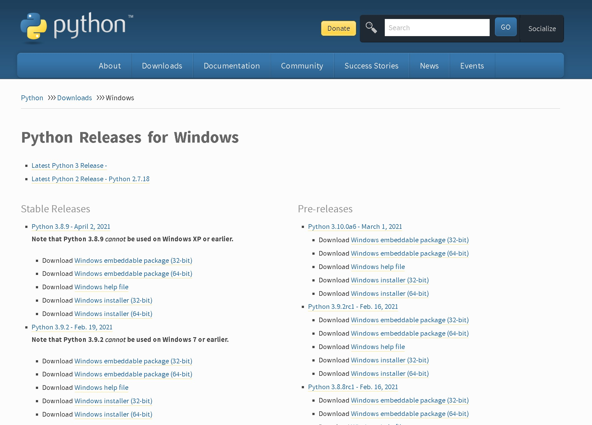
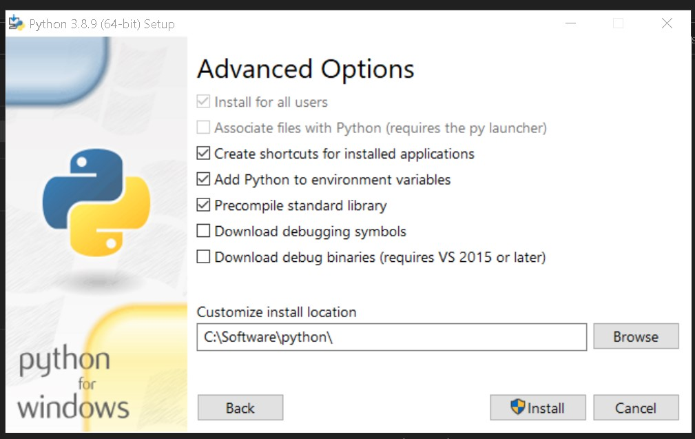
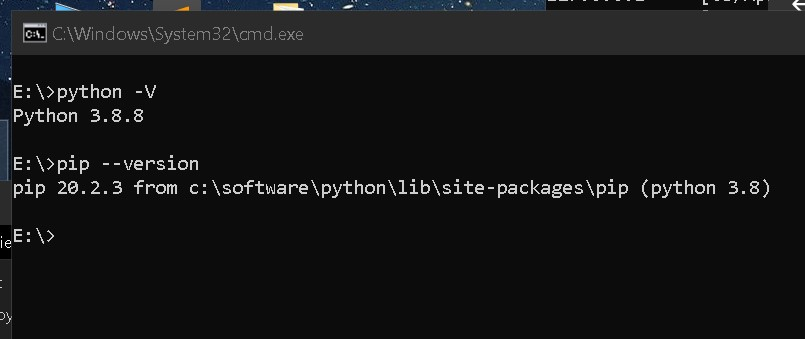
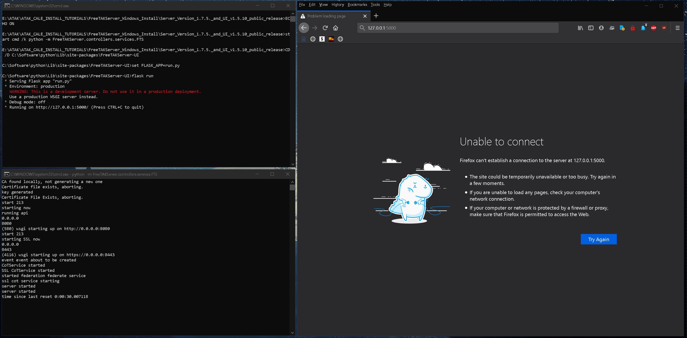

# FreeTAKServer Install On Windows Computer

Below is the installation commands and comments for the installation of FreeTAKServer on a windows computer:

-----------

## Install Instructions (Tested on Server Version 1.7.5. and UI v1.5.10)

1. Install python from python.org

   [Download and run the installer](https://www.python.org/downloads/windows/).
 
   Choose the installer option.
 
   [](pythoninstall.jpg)

   Check pip, tcl/tk and IDLE and the Python test suite.

   [](features.jpg)

   Make sure you add Python to environment variables for easy use.

   [](advanced.jpg)

2. Verify python environment 

   Now check that python and pip are installed and working correctly. *You should be able to open cmd anywhere and do this check*:

   ```shell
   python -V

   pip --version
   ```

   [](chkpypip.jpg)

3. Install Python packages

   Once you have checked that Python and pip are working install the requirements:

   1. Perform install one by one via pip.

      ```shell
      pip install flask
      pip install flask_login
      pip install flask_migrate
      pip install flask_wtf
      pip install flask_sqlalchemy
      pip install email_validator
      pip install gunicorn

      pip install coveralls
      pip install coverage
      pip install pytest
      pip install flake8
      pip install flake8-print
      pip install pep8-naming
      pip install selenium
      ```

   2. (alternate) Perform install from a file.

      From a file Paste these requirements into a .txt file `requirements.txt` for example:
      ```text
      flask
      flask_login
      flask_migrate
      flask_wtf
      flask_sqlalchemy
      email_validator
      gunicorn
      coveralls
      coverage
      pytest
      flake8
      flake8-print
      pep8-naming
      selenium
      ```

      Now change into the directory (`cd`) containing said `requirements.txt` file and run the command below:

      ```shell
      pip install -r requirements.txt
      ```

   3. (alternate) Install packages via conda/mamba.

      Create an environment.
      ```shell
      mamba create --name tak
      mamba activate tak
      ```
      
      Install the packages into the environment.      
      ```shell
      mamba install lxml pathlib tabulate setuptools
      mamba install flask flask-login flask-migrate flask-wtf
      mamba install sqlalchemy flask-sqlalchemy 
      mamba install flake8 flake8-print 
      mamba install email-validator
      mamba install pytest coveralls coverage
      mamba install pep8-naming selenium
      pip install gunicorn
      ```

   4. Install FreeTAKServer
      When all the requirements have been satisfied install the FreeTAKServer.
      ```shell
      pip install FreeTAKServer[ui]
      ```

4. Configure the FTS

   After the installation has finished open the `MainConfig.py` file for editing.

   The contents must be changed fo that the Windows paths can communicate with FTS.

   ```text
   MY PATH EXAMPLE
   C:\Software\python\Lib\site-packages\FreeTAKServer\controllers\configuration\MainConfig.py
   ```

   Edited contents for Windows machines:

   ```python

   import os

   currentPath = os.path.dirname(os.path.abspath(__file__))
   from pathlib import Path


   class MainConfig:
     """
     this is the main configuration file and is the only one which
     should need to be changed
     """
     # this is the port to which clients will connect
     CoTServicePort = int(os.environ.get('FTS_COT_PORT', 8087))

     SSLCoTServicePort = int(os.environ.get('FTS_SSLCOT_PORT', 8089))

     # this needs to be changed for private data packages to work
     DataPackageServiceDefaultIP = str(os.environ.get('FTS_DP_ADDRESS', "0.0.0.0"))

     # User Connection package IP needs to be set to the IP which is used when creating the connection in your tak device
     UserConnectionIP = str(os.environ.get('FTS_USER_ADDRESS', "0.0.0.0"))

     #Path to the site-packages dir in your python installation
     python_install_path = 'C:\\Software\\python\\Lib\\site-packages'

     # api port
     APIPort = os.environ.get('FTS_API_PORT', 19023)

     # Federation port
     FederationPort = os.environ.get('FTS_FED_PORT', 9000)

     # api IP
     APIIP = os.environ.get('FTS_API_ADDRESS', '0.0.0.0')

     # allowed ip's to access CLI commands
     AllowedCLIIPs = ['127.0.0.1']

     # IP for CLI to access
     CLIIP = '127.0.0.1'

     # whether to save CoT's to the DB
     SaveCoTToDB = bool(os.environ.get('FTS_COT_TO_DB', True))

     # this should be set before startup

     DBFilePath = str(os.environ.get('FTS_DATA_PATH', fr'{python_install_path}\\FreeTAKServer\\') + "FTSDataBase.db")

     # the version information of the server (recommended to leave as default)
     version = 'FreeTAKServer-1.7.5 Public'

     MainPath = str(os.environ.get('FTS_DATA_PATH',
                    Path(fr'{python_install_path}\\FreeTAKServer')))

     ExCheckMainPath = str(Path(fr'{MainPath}\\ExCheck'))

     ExCheckFilePath = str(Path(fr'{MainPath}\\ExCheck\\template'))

     ExCheckChecklistFilePath = str(Path(fr'{MainPath}\\ExCheck\\checklist'))

     DataPackageFilePath = str(Path(fr'{MainPath} \\FreeTAKServerDataPackageFolder'))

     # format of API message header should be {Authentication: Bearer 'TOKEN'}
     from uuid import uuid4
     id = str(uuid4())

     nodeID = os.environ.get('FTS_NODE_ID', f"FreeTAKServer-{id}")

     # set to None if you don't want a message sent
     ConnectionMessage = f'Welcome to FreeTAKServer {version}. The Parrot is not dead. It’s just resting'

     certsPath = os.environ.get('FTS_CERTS_PATH', fr'{MainPath}/certs')

     keyDir = str(Path(fr'{certsPath}\\pubserver.key'))

     pemDir = str(Path(fr'{certsPath}\\pubserver.pem'))  # or crt

     unencryptedKey = str(Path(fr'{certsPath}\\pubserver.key.unencrypted'))

     p12Dir = str(Path(fr'{certsPath}\\pubserver.p12'))

     CA = str(Path(fr'{certsPath}\\ca.pem'))
     CAkey = str(Path(fr'{certsPath}\\ca.key'))

     federationCert = str(Path(fr'{certsPath}\\pubserver.pem'))
     federationKey = str(Path(fr'{certsPath}\\pubserver.key'))
     federationKeyPassword = str(os.environ.get('FTS_FED_PASSWORD','defaultpass'))
    
     # location to backup client packages
     clientPackages = str(Path(fr'{MainPath}\\certs\\ClientPackages'))

     password = str(os.environ.get('FTS_PASSWORD', 'defaultpass'))

     websocketkey = os.environ.get('FTS_WEBSOCKET_KEY', "YourWebsocketKey")
   ```

   When finished configuring `MainConfig.py` open the `config.py` file for editing.
   ```text
   MY PATH EXAMPLE
   C:\Software\python\Lib\site-packages\FreeTAKServer-UI\config.py
   ```

   Edited contents for Windows machines:

   ```python
   # -*- encoding: utf-8 -*-
   """
   License: MIT
   Copyright (c) 2019 - present AppSeed.us
   """

   import os
   from   os import environ

   class Config(object):

     basedir    = os.path.abspath(os.path.dirname(__file__))

     SECRET_KEY = 'key'

     # This will connect to the FTS db
     SQLALCHEMY_DATABASE_URI = 'sqlite:///' + 'C:\\Software\\python\\Lib\\site-packages\\FreeTAKServer\\FTSDataBase.db'

     # certificates path
     certpath = "C:\\Software\\python\\Lib\\site-packages\\FreeTAKServer\\certs\\"

     # crt file path
     crtfilepath = f"{certpath}pubserver.pem"

     # key file path
     keyfilepath = f"{certpath}pubserver.key.unencrypted"

     # this IP will be used to connect with the FTS API
     IP = '127.0.0.1'

     # Port the  UI uses to communicate with the API
     PORT = '19023'

     # the public IP your server is exposing
     APPIP = '127.0.0.1'

     # this port will be used to listen
     APPPort = 5000

     # the webSocket  key used by the UI to communicate with FTS.
     WEBSOCKETKEY = 'YourWebsocketKey'

     # the API key used by the UI to comunicate with FTS. generate a new system user and then set it
     APIKEY = 'Bearer token'

     # For 'in memory' database, please use:
     # SQLALCHEMY_DATABASE_URI = 'sqlite:///:memory:'
            
     SQLALCHEMY_TRACK_MODIFICATIONS = False

     # THEME SUPPORT
     #  if set then url_for('static', filename='', theme='')
     #  will add the theme name to the static URL:
     #    /static/<DEFAULT_THEME>/filename
     # DEFAULT_THEME = "themes/dark"
     DEFAULT_THEME = None


   class ProductionConfig(Config):
     DEBUG = False

     # Security
     SESSION_COOKIE_HTTPONLY = True
     REMEMBER_COOKIE_HTTPONLY = True
     REMEMBER_COOKIE_DURATION = 3600

     # PostgreSQL database
     SQLALCHEMY_DATABASE_URI = 'postgresql://{}:{}@{}:{}/{}'.format(
        environ.get('APPSEED_DATABASE_USER', 'appseed'),
        environ.get('APPSEED_DATABASE_PASSWORD', 'appseed'),
        environ.get('APPSEED_DATABASE_HOST', 'db'),
        environ.get('APPSEED_DATABASE_PORT', 5432),
        environ.get('APPSEED_DATABASE_NAME', 'appseed')
     )


   class DebugConfig(Config):
     DEBUG = True


   config_dict = {
     'Production': ProductionConfig,
     'Debug': DebugConfig
   }

   ```

5. Start the Server

   In order to run the server and the GUI two terminal windows must be opened and the commands below must be run:
   
   SERVER START COMMAND
   ```shell
   python -m FreeTAKServer.controllers.services.FTS
   ```
   UI START COMMAND
   ```shell
   cd C:\Software\python\Lib\site-packages\FreeTAKServer-UI
   set FLASK_APP=run.py
   flask run
   ```

6. Connect to the Server

   Now your server should be running. `User = admin`, `Password = password` and `GUI link` http://localhost:5000/

   [](FTS_windows.gif)

7. Uninstall FTS

   To uninstall do:
   ```shell
   pip uninstall FreeTAKServer
   pip uninstall FreeTAKServer-UI
   ```

   Then in the `C:\Software\python\Lib\site-packages\FreeTAKServer\` delete the `FTSDataBase.db` file.

   In the `C:\Software\python\Lib\site-packages\` path delete the `FreeTAKServer` & `FreeTAKServer-UI` folders.


## Notes

If you would like to set up a Batch file (to run the server on a double click) use the commands below:

Create a `.bat` file to run the server on double click and on startup:

`StartFreeTAKServer.bat`

```bat
::START THE SERVER
ECHO ON
start cmd /k python -m FreeTAKServer.controllers.services.FTS
::WHEN RUNNING THE SCRIPT FROM A DIFFERENT DRIVE ADD THE `/D` SWITCH TO YOUR `CD` COMMAND
CD /D C:\Software\python\Lib\site-packages\FreeTAKServer-UI
set FLASK_APP=run.py
flask run
pause
```
Now to run at startup: Go to Run (`WINDOWS + R`) and Type `shell:startup`, and paste a copy of your `StartFreeTAKServer.bat` file there.

> To check python version `python -V`

> To quickly check your IP `ipconfig`
