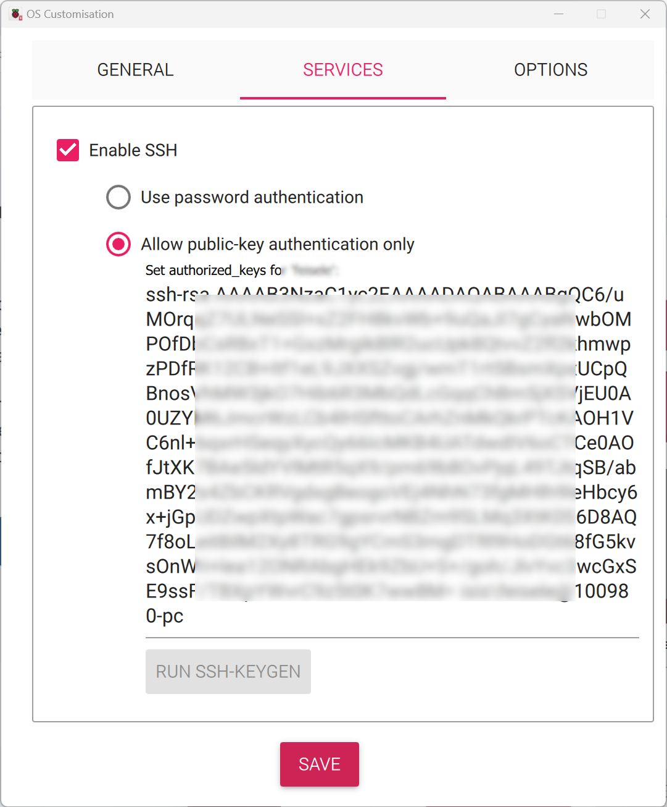

# Raspberry Pi

this procedure Installs FTS + UI + video Server onto a Raspberry Pi

## Hardware requirements
you need a RaspPi with at least 4 GB RAM

## Procedure

### Prepare an SD Card
Start with new installation of ubuntu 22.04 server for RaspPi 64.
FTS 2.1 expects [Ubuntu 22.04 (64 bit)](https://ubuntu.com/download/raspberry-pi/thank-you?version=22.04.3&architecture=server-arm64+raspi).

You will need an imager.

* [Raspberry Pi Imager](https://www.raspberrypi.com/software/) (you may also use [BalenaEtcher Imager](https://www.balena.io/etcher))

Follow the instructions to prepare an SD card with the appropriate image.


The `rpi-imager` provides a means for setting an `ssh` authorized key
and default `username` and `password`. 

{: style="height:200px;width:150px" }
{: style="height:200px;width:150px" }

I construct an ssh key-pair specifically for working with compute nodes.
Construction of such key-pairs is done with [ssh keygen](https://www.ssh.com/academy/ssh/keygen).
Presume that the key-pair thus generated is `~/.ssh/fts_rsa` and `~/.ssh/fts_rsa.pub`.

### Setup Hardware

 * insert the prepared SD card into the Raspberry Pi.
 * connect a keyboard
 * connect a monitor
 * connect to an ethernet network

### Update the OS

The initial setup takes ~5 minutes on a RaspPi 4
Login with `fts` / `ubuntu` (or whichever user you selected)

If the RaspPi is connected to your router,
when it boots it will display the IP grabbed from DHCP server.
Write down the IP address, we will need it later.

```bash
sudo apt update -y 
sudo apt upgrade -y
```
You may be prompted during the upgrade.
Generally, accepting the defaults is appropriate.

In some cases you need to run: 
```sudo apt full-upgrade``` or ```sudo apt-get dist-upgrade```.

It is generally easier to communicate with your server via `ssh`.
You will need the IP address (you should write the address down for later reference).
```bash
sudo apt install -y net-tools
```
```bash
ip addr show
```
Here is representative fragment from an output.
```text
2: eth0: <BROADCAST,MULTICAST,UP,LOWER_UP> mtu 1500 qdisc mq state UP group default qlen 1000
    link/ether d8:3a:dd:5f:27:24 brd ff:ff:ff:ff:ff:ff
    inet 10.2.118.237/24 metric 100 brd 10.2.118.255 scope global dynamic eth0
       valid_lft 53818sec preferred_lft 53818sec
    inet6 fe80::da3a:ddff:fe5f:2724/64 scope link
       valid_lft forever preferred_lft forever
```
The IP address in this case is `10.2.118.237`.
This is the same address you may have captured earlier during initial boot.

Multiple `reboot` may be required to get the OS fully updated.
```bash
sudo reboot 
```

From here on it should be possible to connect via `ssh`.
Here is an example with the IP address obtained previously and `fts` user.
```bash
ssh fts@10.2.118.237
```
I generally update the `~/.ssh/config` file with this information:
```config 
Host fts-rp1
    HostName 10.2.118.237
    User fts
    IdentityFile ~/.ssh/fts_rsa
```

### Update Prerequisites

Verify the following packages are installed.
```bash
sudo apt install -y wget curl
```

### Run the Zero Touch Installer (ZTI)

The [complete ZTI instructions are here](../../mechanism/Ansible/ZeroTouchInstall.md).


#### Custom IP Address
By default, the `ZTI` guesses your IP address.
When installing on the RaspberryPi it is unlikely that this is what you want.
There are several ways to discover a candidate IP address, here are some.

Wired, ethernet, RJ45, LAN
```bash
ip -4 addr show eth0 | grep -oP '(?<=inet\s)\d+(\.\d+){3}'
```
WiFi, LAN
```bash
ip -4 addr show wlan0 | grep -oP '(?<=inet\s)\d+(\.\d+){3}'
```
On the public internet.
```bash
curl ifconfig.me/ip
```
Here is an example capturing the wired LAN address:
```bash
export MY_IP=$(ip -4 addr show eth0 | grep -oP '(?<=inet\s)\d+(\.\d+){3}')
```
With an appropriate IP address in hand you can run the `ZTI`.
```bash
wget -qO - bit.ly/freetakhub2 | sudo bash -s -- --ip-addr ${MY_IP}
```
Alternate, full path.
```bash
wget -qO - https://raw.githubusercontent.com/FreeTAKTeam/FreeTAKHub-Installation/main/scripts/easy_install.sh | sudo bash -s -- --ip-addr ${MY_IP}
```

## Operation

`ZeroTouch` will have configured the system and started the services for you. 
However, there are many corner cases which `ZeroTouch` may miss.
Many (if not all) of the choices made by `ZeroTouch` are written to stdout.
I recommend that you validate the properties in that output.
I recommend that you stop the fts services prior to reconfiguration.

* [Service Management](../../../administration/Operation/fts-config.md)
* [Configuration](../../../administration/Operation/fts-config.md)


## RPiFTS Series

GHOST_DA-B6 has created a set of videos on `youtube` detailing how to install
and set up FTS on raspberry pi `SBC's`.

You can view his RPiFTS video series on
his [channel](https://www.youtube.com/channel/UC--WpY--HV7PymMWLgfflZA).

