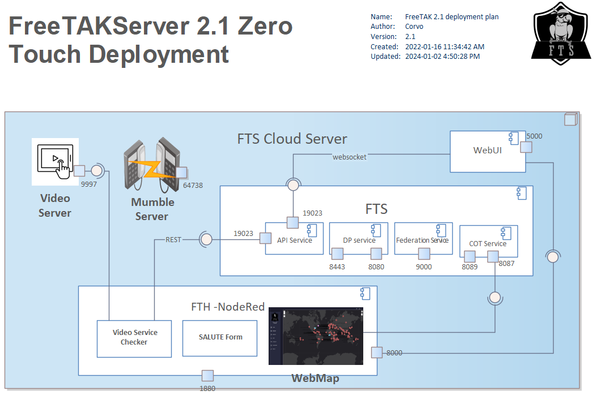

# Video Server (third party application)




The video server is a third party application.

The video server is [Media MTX](https://github.com/bluenviron/mediamtx) (previously known as `rtsp-simple-server`.

## Known Issues

It may be that your problem may be related to a known issue.
Please, check the known issues.

* [Open Issues](https://github.com/FreeTAKTeam/FreeTAKHub_VideoChecker/issues)
* [Bugs](https://github.com/FreeTAKTeam/FreeTAKHub_VideoChecker/labels/bug)


## Acquire the Appropriate Version

Different versions exist depending on the type of RaspPi you are using.
Instructions below are for RaspPi 4, having an ARM64 v8 processor.

This example uses a specific version verified for use with `FTS`,
vis. <https://github.com/bluenviron/mediamtx/releases/tag/v0.18.5>.

```bash
wget https://github.com/bluenviron/mediamtx/releases/download/v0.18.5/rtsp-simple-server_v0.18.5_linux_arm64v8.tar.gz
```

Extract the application into a suitable directory, e.g. `/opt`.
```bash
sudo mkdir -p /opt/mediamtx
sudo tar -zxvf rtsp-simple-server_v0.18.5_linux_arm64v8.tar.gz -C /opt/mediamtx/
```

Edit the configuration file `/opt/mediamtx/rtsp-simple-server.yml`.
The following shows the fragments of interest, before editing.
```yaml
# Enable the HTTP API.
api: no
# Address of the API listener.
apiAddress: 127.0.0.1:9997

# Encrypt handshake and TCP streams with TLS (RTSPS).
# Available values are "no", "strict", "optional".
encryption: "no"
# Address of the TCP/RTSP listener. This is needed only when encryption is "no" or "optional".
rtspAddress: :8554
# Address of the TCP/TLS/RTSPS listener. This is needed only when encryption is "strict" or "optional".
rtspsAddress: :8322
```
* Enable the HTTP API
* Set the listener's address to the RaspPi's IP address (or ZeroTier)

Here is an example with the relevant properties after updates (in context).
```yaml
# Enable the HTTP API.
api: yes
# Address of the API listener.
apiAddress: 10.2.118.237:9997

# Encrypt handshake and TCP streams with TLS (RTSPS).
# Available values are "no", "strict", "optional".
encryption: "no"
# Address of the TCP/RTSP listener. This is needed only when encryption is "no" or "optional".
rtspAddress: 10.2.118.237:8554
# Address of the TCP/TLS/RTSPS listener. This is needed only when encryption is "strict" or "optional".
rtspsAddress: :8322
```

## Smoke Test (is it running?)

* https://github.com/FreeTAKTeam/FreeTAKHub-Installation/blob/main/roles/videoserver/templates/rtsp-simple-server.service.j2

```text
{!Troubleshooting/mediamtx.service!}
```

Put the `mediamtx.service` file in `/etc/systemd/system/mediamtx.service`.
```bash
sudo systemctl daemon-reload
sudo systemctl enable mediamtx.service
sudo systemctl start mediamtx.service
```

## Integrate Media Server with Integration Server

This presumes the prior installation of [`NodeRed`](fts-hub-server).

The integration server is configured with the `video-checker` via a `JSON` file.
`NodeRed` provides <https://github.com/FreeTAKTeam/FreeTAKHub_VideoChecker>.

<https://github.com/FreeTAKTeam/FreeTAKHub_VideoChecker/tree/2.0>

* <https://github.com/FreeTAKTeam/FreeTAKHub_VideoChecker/blob/2.0/FreeTAKHub%20VideoChecker.json>
* <https://github.com/FreeTAKTeam/FreeTAKHub_VideoChecker/blob/main/freetakhub_videochecker.json>

## Connect a Client (ICU and/or drone) to Video Server

* Receive the CoT notification in TAK client (`WinTAK` and `ATAK`)
* Use notification to start video (`WinTAK` and `ATAK`)

