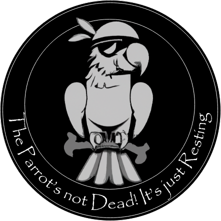

# FreeTAKServer




FreeTAKServer (FTS) is a Python3 implementation of a TAK Server.

## Quick Start

The easiest way to install FTS is to use our Ansible based ZeroTouch Installer.

There are two recommended platforms.
you may be able to simply use one of the following:

### Cloud: DigitalOcean 

[Create a droplet with Ubuntu 22.04 as the OS.](./Installation/platform/Cloud/DigitalOcean.md)
```bash
wget -qO - bit.ly/freetakhub2 | sudo bash
```
??? tip "Alternate, full path."
    ```bash
    wget -qO - https://raw.githubusercontent.com/FreeTAKTeam/FreeTAKHub-Installation/main/scripts/easy_install.sh | sudo bash
    ```

### Single Board Computer: Raspberry Pi 4

[Create an `sdcard` with Ubuntu 22.04 server x64 as the OS](./Installation/platform/RaspberryPi/Installation.md).

This case is not quite 'zero-touch' as you will need to first identify the IP address of your Raspberry Pi
and set an environment variable.
```bash
export MY_IPA=<the appropriate IP address>
```
??? example "Here is an example capturing the wired LAN address:"
    ```bash
    export MY_IPA=$(ip -4 addr show eth0 | grep -oP '(?<=inet\s)\d+(\.\d+){3}')
    ```

```bash
wget -qO - bit.ly/freetakhub2 | sudo bash -s -- --ip-addr ${MY_IPA}
```
??? tip "Alternate, full path."
    ```bash
    wget -qO - https://raw.githubusercontent.com/FreeTAKTeam/FreeTAKHub-Installation/main/scripts/easy_install.sh | sudo bash -s -- --ip-addr ${MY_IPA}
    ```

### Other

We can not predict all the ways in which these base cases may vary.
In that case you will need to read the [ZeroTouch Installer](Installation/mechanism/Ansible/ZeroTouchInstall.md).

## Overview

A TAK Server, like FTS, services end user devices running client applications such as...
[`ATAK-CIV`](https://play.google.com/store/apps/details?id=com.atakmap.app.civ),
[`WinTAK`](https://www.civtak.org/2020/09/23/wintak-is-publicly-available/),
and [`iTAK`](https://apps.apple.com/us/app/itak/id1561656396).
FTS is a cross-platform project that,
as of release 2.1,
provides Situational Awareness and other capabilities such as:

- Web administration
- Federation Service (Connecting two or more FTS instances)
- Data Package upload and retrieval
- Image transfer and storage
- CoT recording in a database
-  Data Sync / Mission Planning
- Execution of common task lists (using the `ExCheck` plugin for `WinTAK`; `ATAK` plugin only available to users with tak.gov access)
- SSL Encryption
- Command Line Interface for start and stop services
- REST API for the creation of information such as emergency, Enemy units, and so on
- Android Edition
- WebMap
- Pushing of information (video streams, certifications, etc.) to clients
- Component based architecture

The following features are in the pipeline  for the 2.x family:

 - Cloud Management
 - ... Much more!

Check out our [roadmap](https://github.com/FreeTAKTeam/FreeTakServer/milestones?direction=asc&sort=due_date&state=open) to see everything we have planned.

## Community
This project is currently in the *Early Production Stage*.

If you have any issues, don't hesitate to [bring them up](https://github.com/Tapawingo/FreeTakServer/issues).
Ensure that you have read the documentation and our [FAQ](About/FAQ.md).
FreeTAKServer is in constant development.
Subscribe to the [pip RSS](https://pypi.org/rss/project/freetakserver/releases.xml) to stay updated on all recent changes.

### FreeTAKTeam
We are FreeTAKTeam, a group of individuals passionate about democratizing Situational Awareness through the power of technology.
Read our [manifesto](About/Manifesto.md).

### FreeTAKTeam YouTube channel
We have created the [FreeTAKTeam YouTube channel is @freetakteam](https://www.youtube.com/@freetakteam) with tutorials, use cases, and more.

### Tell us what you think!
To discuss with our active developers, you may use:
- The [FTS Discord](https://discord.gg/m8cBzQM2te) Server

### Others
 - Are you a fellow Redditor? Join us on the [TAK subreddit](https://www.reddit.com/r/ATAK/)!

### Donate Back
The FreeTAKTeam is working daily developing an open solution.
We plan to do more than just replicating the functionalities of the legacy TAK server.
Check out our road map [roadmap](https://github.com/FreeTAKTeam/FreeTakServer/milestones?direction=asc&sort=due_date&state=open) to see what is currently in the works.
It includes a lot of cool ideas.

We are doing it for free because
we believe that donating personal time to a cause is an endeavor that is worthy per se.
However, part-time, we are also funding resources dedicated to:

- Maintaining public and testing servers
- Investing in different technologies for R&D

If you feel that FTS is valuable to you,
and you are able to donate in these challenging times,
please consider sending a contribution: [DONATE](https://www.paypal.com/cgi-bin/webscr?cmd=_donations&business=brothercorvo%40gmail.com&item_name=FreeTAKServer+R%26D&currency_code=CAD&source=url)


You can also support the project by buying one of our [T-Shirts](http://tee.pub/lic/elARpZYCmaw)

!!! note
    We are not big fans of `Paypal`,
    but it is the easiest and most accessible way we have found for enabling some form of funding.
    We hope to implement a more ethical system in the future.

### Public Instance

[](https://www.digitalocean.com/?refcode=f107fe7b7131&utm_campaign=Referral_Invite&utm_medium=Referral_Program&utm_source=badge)

We support a public instance of FTS hosted by DigitalOcean.

- download the configuration [here](assets/fts-official-pub.zip)
- use the Import Manager in `ATAK` to import the configuration.
- for a full tutorial see the [article](About/PubServer.md)

!!! warning
    The documentation for FTS is a work-in-progress.
    If you find any of the documentation confusing please discuss it on the [FTS Discord server](https://discord.gg/m8cBzQM2te) .
    Please [report any errors as an issue](https://github.com/FreeTAKTeam/FreeTAKServer-User-Docs/issue).
    